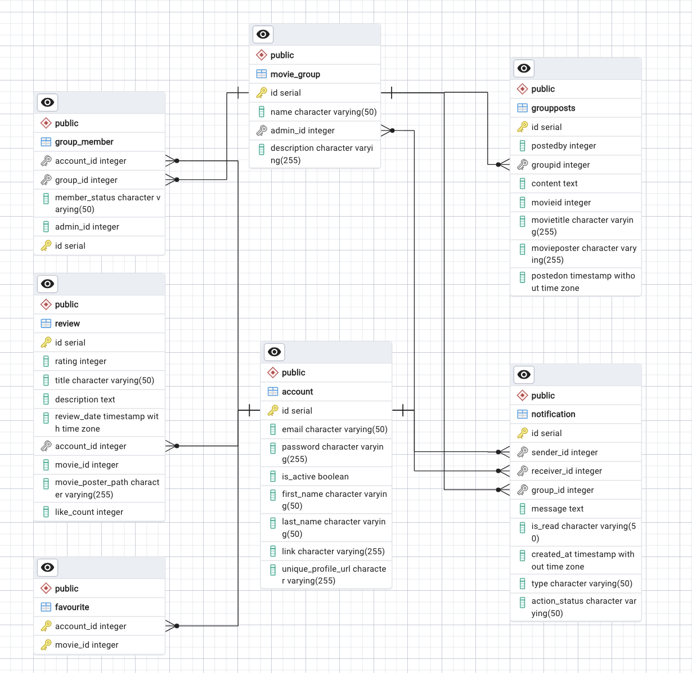

# 🎬 **MovieVerse**

## Table of Contents

1. About
2. Key Features
3. Technologies Used
4. Project Team Members
5. Database Structure
6. Interface Description
7. Getting Started
8. Website Link

---

## 📖 About

**MovieVerse** is a website created for movie enthusiasts, offering tools to explore, rate, review, and discover movies. Whether you’re a casual viewer or a die-hard movie fan, you’ll find features designed to enhance your entertainment experience.

---

## ⭐ Key Features

### Extensive Database

Browse a wide catalog of movies, each with:

- **Description**
- **Rating**
- **Trailer**
- **Cast Details**
- **User Reviews**

Search and select movies with different criteria.

Check movie showtimes in cinemas in Finland.

### User Profiles

- **Create favorites lists** and share them.
- **Customizing groups** of movie enthusiasts with similar interests.
- **User account management** of signing up/in and removing user account.

### Optional features

- **Like reviews** and sort reviews by date and likes.
- **Edit user information** to keep updated.
- **Notifications** of user sending request to join groups and receiving reponse from group admins.

---

## 🛠️ Technologies Used

- **Frontend:** React
- **Backend:** Node.js, Express
- **Database:** PostgreSQL
- **APIs:** TMDB, Finnkino
- **Deployment:** Azure, Render, Supabase

---

## 👥 Project Team Members

- **Congying Zhao**: Homepage, showtimes page, groups management, review functionalities, user profile management, application deployment
- **Anna Kasprzak**: Database structure, search functionality
- **Sandip Bade**: Explore page, group feature
- **Manjula Karunanayaka**: Favorites, add reviews, movie details page, website responsiveness, static pages.
- **Shankar Jaiswal**: Website template, account management

---

## 🗄️ Database Structure

ng)

### Tables:

- **account** – Stores user credentials and profile information  
  _(email, hashed password, first/last name, active flag, profile link, etc.)_
- **review** – User reviews for movies, including rating, title, text, review date, poster path and like count.
- **favourite** – Junction table between `account` and movies, storing each user’s favourite movie list.
- **movie_group** – User-created movie groups, including group name, description and admin (owner).
- **group_member** – Memberships of users in groups, including status (`accepted / declined / pending`) and admin id.
- **groupposts** – Posts made inside groups (text content + optional movie info like title and poster).
- **notification** – Notifications related to group join requests and admin responses, with type and read status.

---

## 🖥️ Interface Description

- **Homepage**: Displays trending movies, search bar, quick links, and user reviews.
- **Search Results**: Lists search results with thumbnails, ratings, and more details.
- **Movie Details Page**: Shows full details, trailer, cast, and user reviews.
- **Review Section**: Browse, sort, like, and share reviews.
- **User Profile**: Manage account settings.
- **Groups Page**: View, manage, create groups, and send join request.
- **Group detail Page**: Post, user leaves groups, and group admin removes member(s).
- **Responsiveness**:

Desktop View

Mobile View

  
  

---

## 🚀 Getting Started

### Prerequisites

- **Node.js**
- **Git**
- **npm**

### Installation

Clone the repository:

git clone https://github.com/t3cozh00/MovieVerse.git

cd movieverse-backend

npm install

npm devStart

---

## 🌐 Website Link https://movieverse-zeta.vercel.app/
